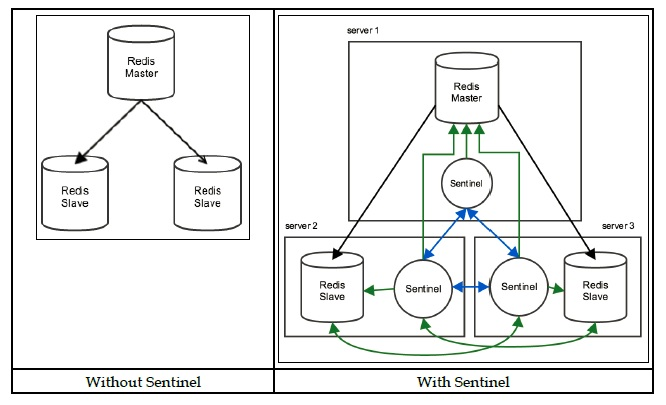

# **Setup a three node Redis Cluster with Sentinel**

* To set up a cluster, we're going to run 3 redis instances :
  - 1 master
  - 2 slaves

* Each of the three instances will also have a redis sentinel server 
  running along side it for monitoring/service discovery
  
  

# **Config**

* Create a directory structure as shown below :
  
    	/<some_path>
        │ 
    	├── node1
    	│   ├── redis.conf
    	│   └── sentinel.conf
    	├── node2
    	│   ├── redis.conf
    	│   └── sentinel.conf
    	└── node3
    	    ├── redis.conf
    	    └── sentinel.conf

* In total there would be three directories, six files

mkdir <some_path>

mkdir <some_path>/node1

mkdir <some_path>/node2

mkdir <some_path>/node3
 
# Master node config

**redis.conf**

bind 127.0.0.1

port 6380

dir .

**sentinel.conf**

bind 127.0.0.1

port 16380

sentinel monitor redis-cluster 127.0.0.1 6380 2

sentinel down-after-milliseconds redis-cluster 5000

sentinel parallel-syncs redis-cluster 1

sentinel failover-timeout redis-cluster 10000

# Slave node config

**redis.conf**

bind 127.0.0.1

port 6381

dir .

slaveof 127.0.0.1 6380

* There is not much difference between the master file, except the
  last line *slaveof 127.0.0.1 6380*
* In order to bootstrap the cluster, we need to tell the slaves where to look
  for a master node
* After the initial bootstrapping process, redis will actually take care of
  rewriting configs as we add/remove nodes

**sentinel.conf**

* Same as master configuration

# Starting the cluster

#### Starting the master node

redis-server /<relative_path>/node1/redis.conf

redis-server /<relative_path>/node1/sentinel.conf --sentinel

#### Starting the slaves

*Slave 1*

redis-server /<relative_path>/node2/redis.conf

redis-server /<relative_path>/node2/sentinel.conf --sentinel

*Slave 2*

redis-server /<relative_path>/node3/redis.conf

redis-server /<relative_path>/node3/sentinel.conf --sentinel

#  Find the master node

* Now that our cluster is in place, we can ask sentinel which node is currently set as the master
* Run the following on one of the slave nodes :

  redis-cli -p 16382 sentinel get-master-addr-by-name redis-cluster

Reference
==========
This is a transcript from this amazing [post](https://seanmcgary.com/posts/how-to-build-a-fault-tolerant-redis-cluster-with-sentinel)

