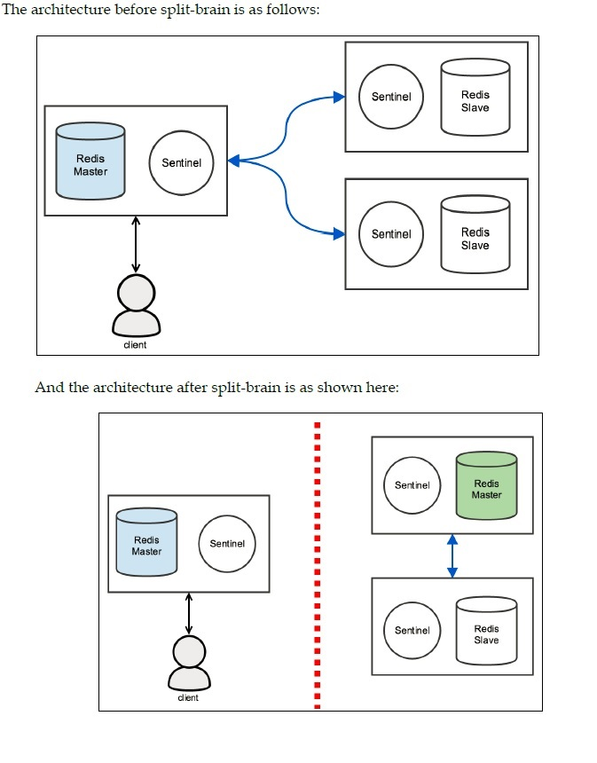

# Network partition (split-brain)

* Redis Sentinel is not strongly consistent in a network partition scenario
* Data may be lost when a split-brain occurs

* To demonstrate how Redis Sentinel will lose data when a split-brain occurs,
  assume the following:
  
  • There are three Redis instances: 

    one master and two replicas. For each Redis instance, there is a Redis Sentinel
  
  • There is a client connected to the current master and writing to it

    

                 **Sentinel_Split_brain_problem**

* If a network partition occurs and separates the current master from all of its slaves,
  and the slaves can still talk to each other, one of the slaves will be promoted to master

* Meanwhile, the client will continue to write to the isolated master

* If the network heals and all the servers are able to communicate to each other again,
  the majority of sentinels will agree that the old master (the one that was isolated)
  should become a slave of the new master (the slave that was promoted to master).
  
  When this happens, all writes sent by the client are lost, because there is no data
  synchronization in this process.

* Redis Sentinel solves the automatic failover problem of high availability,
  but it does not solve the problem of distributing data across multiple 
  Redis instances
